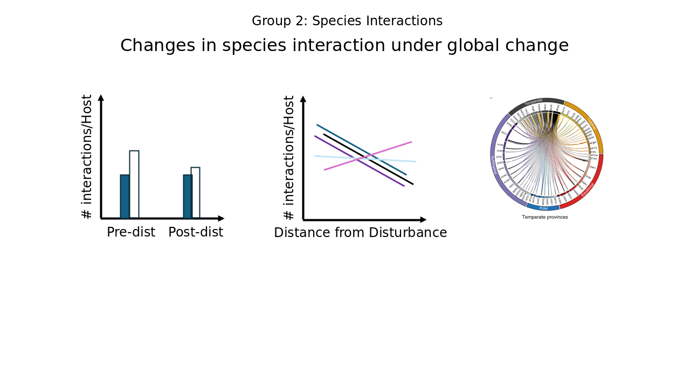
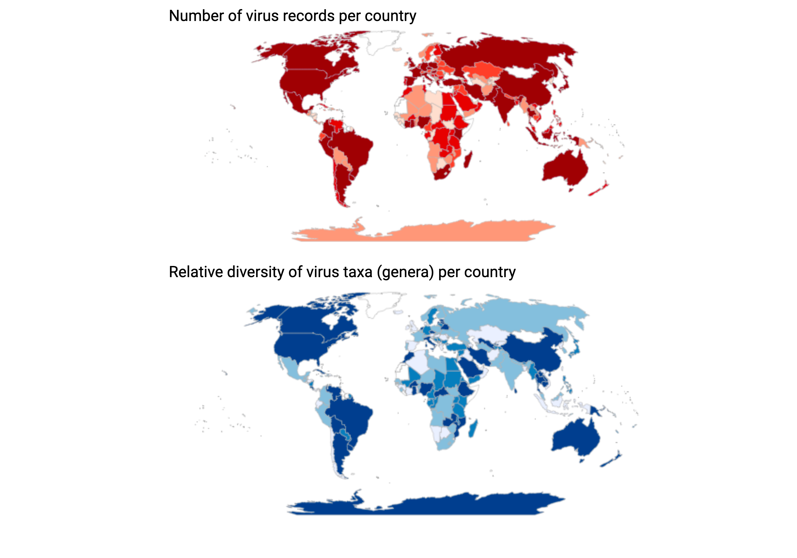

# Group 2 --  "Changes in species interactions under global change"

!!! Success "Provocotive question"

    How species iteractions change given extreme events while accounting for global change (change in phenology, range shifts, ext)

## Group Members
- Marie-Josee Fortin: fortinmj@gmail.com
- Aaron Krivchenia: aaron.krivchenia@gmail.com
- Lizzie Lombardi: lizzie.lombardi@gmail.com
- Rob Ramos: rob.james.ramos@gmail.com
- Jeremy Wojdak: jeremy.wojdak@gmail.com
- Israel Borokini: isreal.borokini@montana.edu

## Code Repository Structure
- **Data Processing**: Scripts for cleaning, merging, and managing datasets.
- **Analysis Code**: Scripts for data analysis, statistical modeling, etc.
- **Visualization**: Code for creating figures, charts, and interactive visualizations.

## Meeting Notes and Agendas
- Regular updates to keep all group members informed and engaged with the project's progress and direction.

## Contributing to This Repository
- Contributions from all group members are welcome.
- Please adhere to these guidelines:
  - Ensure commits have clear and concise messages.
  - Document major changes in the meeting notes.
  - Review and merge changes through pull requests for oversight.

## Getting Help
- If you encounter any issues or have questions, please refer to the [ESIIL Support Page](https://esiil-support-page-url/) or contact the repository maintainers directly.
