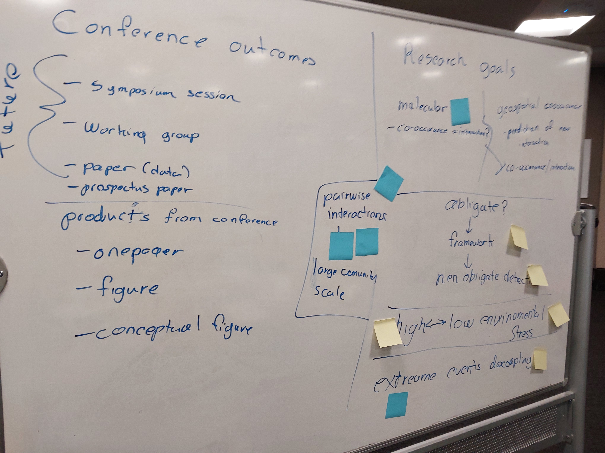
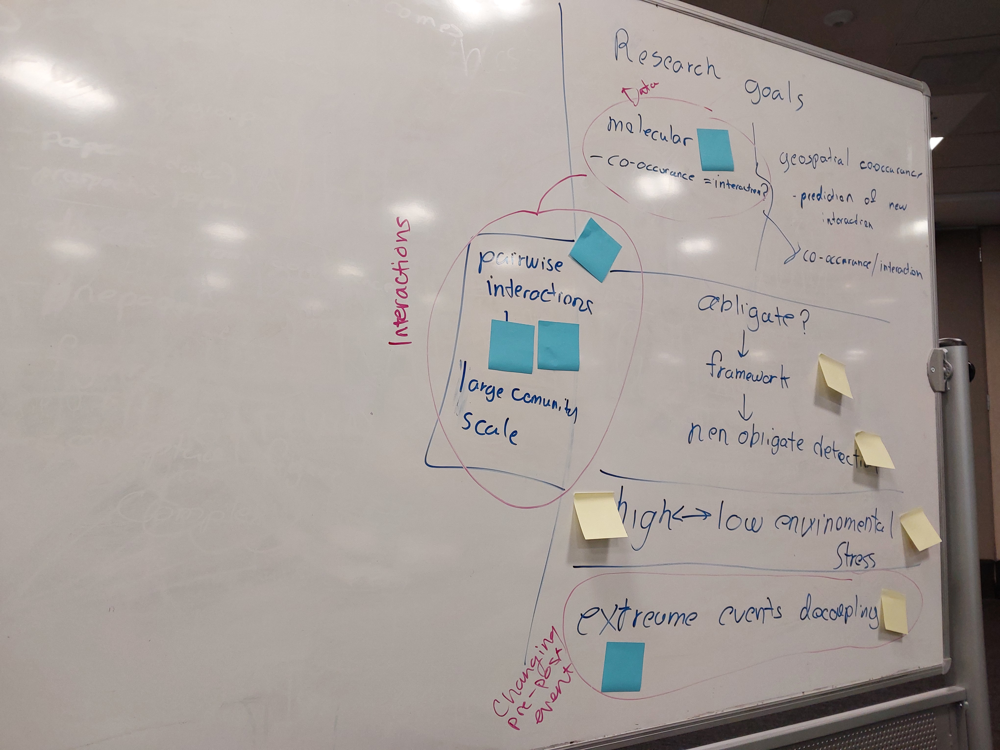

# Summit Notes

## Day 1: brainstorming
We ultimately landed on a bunch of different possibilites. Probably we want to use genomic data or metagenomic data to look at interactions over time and space, with particular interest in how (a)synchronous interactions are/may be in the future 

## Day 2: getting into it

### INSDC host organism dataset accessible through GBIF
maybe useful virus data records: https://www.gbif.org/dataset/393b8c26-e4e0-4dd0-a218-93fc074ebf4e#description.
- The download for 5/15/2024 is on cyverse datastore. (Community Data/iplant_esiil_summit/2024/GBIF/GBIF_0016186-240506114902167.zip)

### Also we could look at LTER datasets available through EDI
example dataset: https://portal.edirepository.org/nis/mapbrowse?packageid=knb-lter-sev.332.2

### Maybe we could use the PHI-base data to identify pathogens that could be leveraged via GBIF?
http://www.phi-base.org/searchFacet.htm?queryTerm=

### Keywords
- Spillover
- Biogeography
- Species "turnover" & "rewiring"
- Prevalence
- Extreme Events (disturbance, weather, human-mediated, ...)
